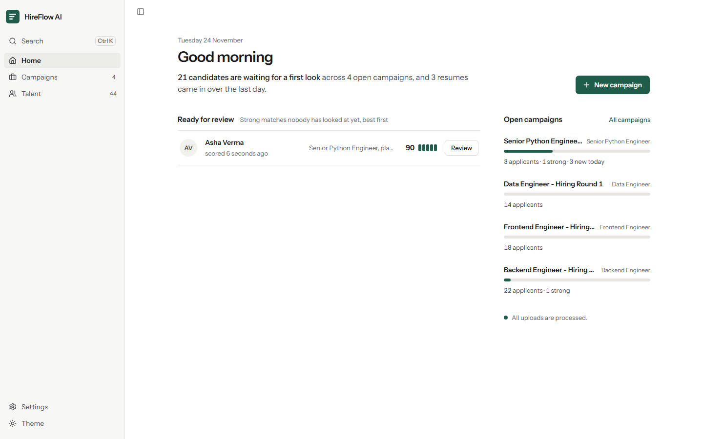
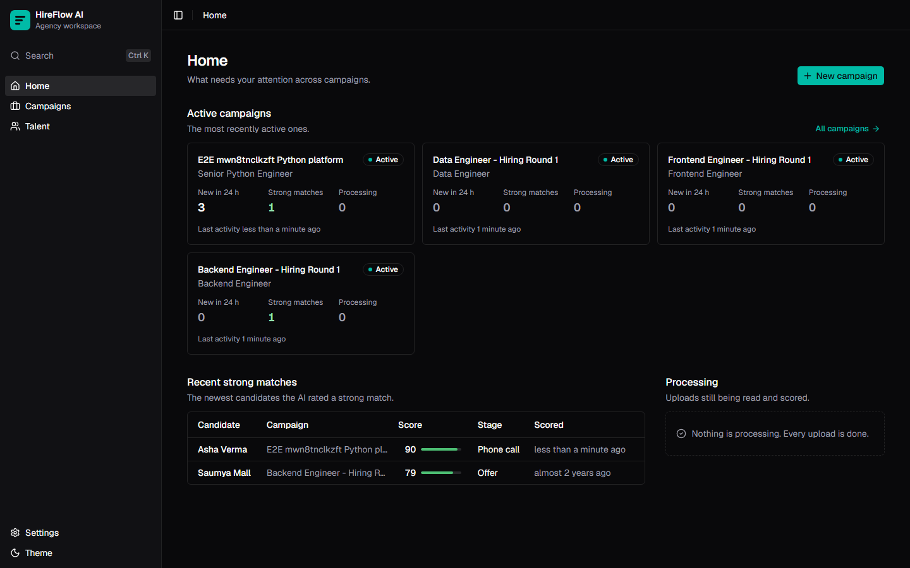
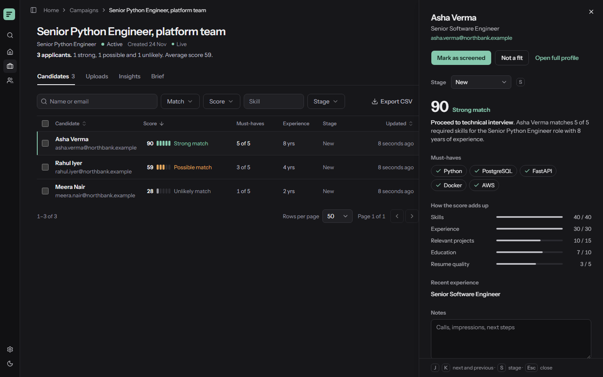
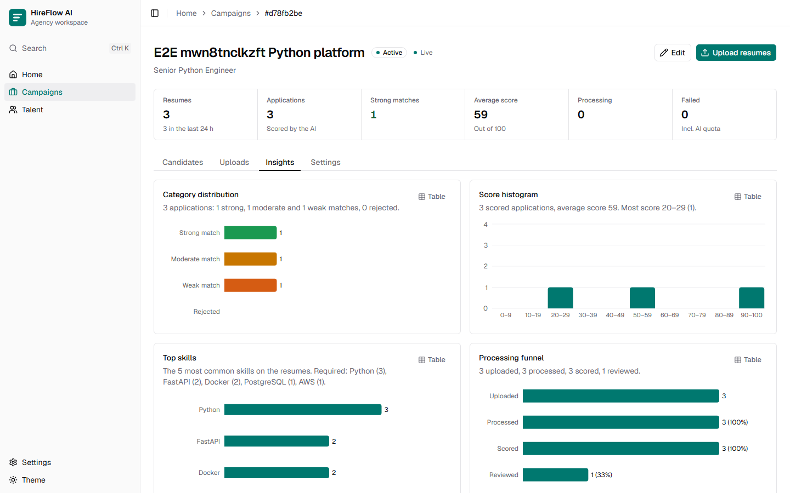
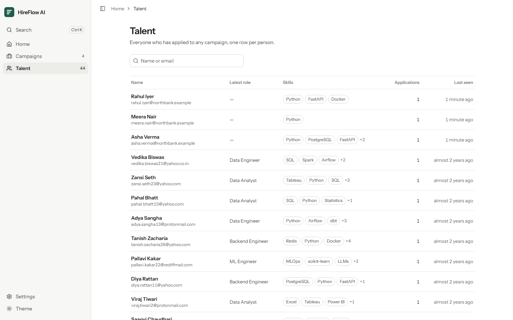
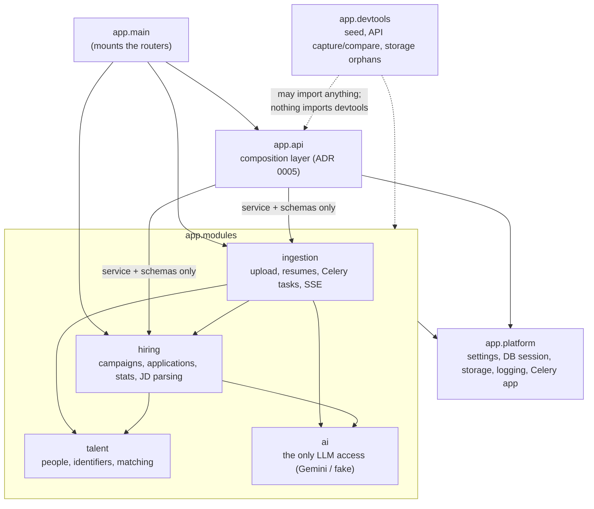

# HireFlow AI

> AI resume screening for recruitment agencies: upload a batch of resumes, get a ranked shortlist, and review every candidate as one person across campaigns. Built with FastAPI, Celery, Next.js and Google Gemini.

---

## Product tour

A recruiter at an agency opens a new role, drops in a batch of resumes and has a ranked, explained
shortlist a few minutes later. Every candidate is one **person** with their history across the
agency's campaigns. Light and dark themes, keyboard-first, built for long sessions.

1. **Home.** A calm "today" page: one sentence on how many candidates wait for a first look,
   the strong matches nobody has reviewed yet (best first, each one click from its review), the
   open campaigns with their counts, and a quiet line about uploads still processing.

   | Light | Dark |
   |---|---|
   |  |  |

2. **New campaign with "Extract with AI".** Paste the job description; the AI fills in the role,
   the required skills (editable chips) and a clean description.

   

3. **Uploads with live progress.** Drop up to 50 PDFs. Each file moves through Uploading →
   Reading → Scoring → Done live (Server-Sent Events, no polling); failures say which step
   failed and can be retried.

   

4. **Ranked candidates and the review panel.** Candidates ranked by score (a number, a
   five-segment meter and a plain word: strong, possible, unlikely), with must-haves counted, and
   filters, sorting and bulk actions that live in the URL. The side panel leads with the decision
   ("Move to phone screen" or "Not a fit"), then the recommendation, the must-haves, how the score
   adds up, recent experience and notes, without leaving the table (J/K to move, S for the stage).

   | Light | Dark |
   |---|---|
   |  |  |

5. **Person profile.** One page per person: contact and links, the AI evaluation for each
   application, the extracted profile, every campaign they applied to with its stage, and notes.

   

6. **Insights.** Per campaign: category distribution, score histogram, top skills against the
   required ones and the processing funnel, each chart with a one-line summary and a data table.

   

7. **Talent.** Everyone who ever applied, as one searchable list of people, ready for the next
   role.

   

8. **CSV export.** "Export CSV" downloads the shortlist in the table's order, with scores,
   categories, stages and notes, for the client or the ATS.

The screenshots come from the end-to-end test run (fake AI, generated resumes); see
[End-to-end tests](#end-to-end-tests) to refresh them. The look and the voice are written down in
the [design guide](docs/design/README.md).

---

## Architecture

One FastAPI backend and two Celery workers, organised as a **modular monolith**
([ADR 0001](docs/adr/0001-modular-monolith.md)): one deployable, one Postgres database, and the
code split into domain modules with boundaries enforced by import-linter in CI.

```
Next.js (frontend) ──HTTP / SSE──▶ FastAPI ──Celery (Redis)──▶ extract worker ──▶ AI worker ──▶ Gemini
                                     │                              │                │
                                     └──── PostgreSQL 16 (pgvector) · MinIO (PDFs) · Redis (queues, SSE pub/sub)
```

### Modules and allowed dependencies


```mermaid
flowchart TD
    main["app.main<br/>(mounts the routers)"]
    api["app.api<br/>composition layer (ADR 0005)"]
    subgraph modules["app.modules"]
        ingestion["ingestion<br/>upload, resumes, Celery tasks, SSE"]
        hiring["hiring<br/>campaigns, applications, stats, JD parsing"]
        talent["talent<br/>people, identifiers, matching"]
        ai["ai<br/>the only LLM access (Gemini / fake)"]
    end
    platform["app.platform<br/>settings, DB session, storage, logging, Celery app"]
    devtools["app.devtools<br/>seed, API capture/compare, storage orphans"]

    main --> api
    main --> ingestion
    main --> hiring
    api -->|service + schemas only| ingestion
    api -->|service + schemas only| hiring
    ingestion --> hiring
    ingestion --> talent
    ingestion --> ai
    hiring --> talent
    hiring --> ai
    modules --> platform
    api --> platform
    devtools -.->|"may import anything;<br/>nothing imports devtools"| api
    devtools -.-> modules
```

An arrow means "may import". The 8 import-linter contracts in
[`backend/pyproject.toml`](backend/pyproject.toml) enforce it:

- Layers `ingestion → hiring → talent`; `talent` and `ai` import no other module.
- A module may import another module only through its **public interface**, `service.py` and
  `schemas.py`, never its `models`, `repository`, `router` or `tasks`. `app.api` follows the same
  rule.
- `platform` imports no module, nothing below `app.api` imports it, nothing imports `devtools`,
  and only `ai` may import an LLM SDK (`google.*`).
- Each module owns its tables, and no foreign key crosses a module boundary
  ([ADR 0003](docs/adr/0003-no-cross-module-foreign-keys.md), checked on the live schema by
  `backend/tests/test_no_cross_module_foreign_keys.py`). Cross-module references are plain UUIDs,
  kept consistent by the services and checked by `verify_people_applications`.

### Request flow

```
HTTP ─▶ router (module's router.py, or app/api/routes.py when an endpoint needs several modules)
     ─▶ service.py (business rules; the module's public interface)
     ─▶ repository.py (SQLAlchemy 2.0 queries on the module's own tables)
```

Routers stay thin. An endpoint that spans modules (campaign detail and stats, every candidate
endpoint, campaign and candidate deletes) lives in `app/api` and calls each module's service in
one request transaction ([ADR 0005](docs/adr/0005-composition-layer.md)). The `/api/v1/candidates*`
endpoints are a compatibility layer: they serve Applications in the pre-E0 response shapes,
pinned by 179 snapshot tests in
[`backend/tests/characterization`](backend/tests/characterization/README.md).

### Upload flow

```
POST /campaigns/{id}/upload            ingestion: validate, hash, store the PDF in MinIO, insert resumes rows
  └─▶ extract_queue: extract_resume    PDF → text (pdfplumber, PyMuPDF, else OCR through ai) → resumes.raw_text
        └─▶ ai_queue: process_candidate_ai
              1. ai.extract_profile    → resumes.extracted (snapshot; skipped on a retry)
              2. ai.score              against the campaign's role and skills
              3. talent.resolve_person ┐ one transaction: find or create the Person
              4. hiring.upsert_application ┘ (advisory locks) and write the Application
  each step ─▶ Redis channel campaign:{id}:events ─▶ GET /campaigns/{id}/stream (SSE)
```

Every step is safe to re-run, `resumes.processing_step` records where a failure stopped, and a
Gemini quota error shows as `quota_exceeded` at once (spec §5). Each campaign has its own event
channel, so a stream only ever receives its own campaign's events.

### Data model

| Module | Table | What it holds |
|---|---|---|
| talent | `people` | One row per human, across campaigns; profile from their newest resume |
| talent | `person_identifiers` | Normalised emails and phones, unique per `(kind, value)`; the matching key ([ADR 0004](docs/adr/0004-identity-matching-policy.md)) |
| talent | `identity_conflicts` | Email and phone pointing at different people: recorded, never auto-merged |
| talent | `person_resumes` | Which Person each resume resolved to (makes resolution idempotent) |
| hiring | `campaigns` | A job: role, required skills, status |
| hiring | `applications` | A Person applying to one campaign (`UNIQUE(campaign_id, person_id)`): scoring, category, pipeline stage, notes |
| hiring | `legacy_candidate_map` | Old candidate ids merged into an application, so old links still resolve |
| ingestion | `resumes` | An uploaded PDF: status, processing step, text, extraction snapshot, its Person |

The legacy `candidates` table was split into People and Applications
([ADR 0002](docs/adr/0002-person-application-split.md)) by an expand → backfill → switch →
contract migration, and dropped in E0-20.

### Further reading

- Design spec: [E0 · Platform core](docs/specs/EPIC-00-platform-core.md); roadmap:
  [docs/roadmap.md](docs/roadmap.md); working process: [docs/process.md](docs/process.md)
- ADRs: [0001 modular monolith](docs/adr/0001-modular-monolith.md) ·
  [0002 Person/Application split](docs/adr/0002-person-application-split.md) ·
  [0003 no cross-module foreign keys](docs/adr/0003-no-cross-module-foreign-keys.md) ·
  [0004 identity matching](docs/adr/0004-identity-matching-policy.md) ·
  [0005 composition layer](docs/adr/0005-composition-layer.md) ·
  [0006 contract-first API client](docs/adr/0006-contract-first-api-client.md) ·
  [0007 frontend state model](docs/adr/0007-frontend-state-model.md) ·
  [0008 `/api/v2` sub-application](docs/adr/0008-api-v2-sub-application.md)
- Runbook: [backfill, read switch and contract](docs/runbooks/person-application-backfill.md)
- Sprints: [1](docs/sprints/sprint-01.md) · [2](docs/sprints/sprint-02.md) ·
  [3](docs/sprints/sprint-03.md) · [4](docs/sprints/sprint-04.md); open follow-ups:
  [docs/backlog.md](docs/backlog.md)

## Features

- **Bulk Upload**: Drag-and-drop up to 50 PDF resumes at once
- **AI Extraction**: Name, email, skills, experience, education via Gemini 2.5 Flash
- **Hybrid PDF Parsing**: pdfplumber (native) → PyMuPDF → Gemini Vision (scanned PDFs)
- **Real-time Updates**: Server-Sent Events (SSE) stream live processing status per file
- **AI Scoring**: Each candidate scored 0–100 against job role requirements
- **Smart Categorization**: Strong Match / Moderate Match / Weak Match / Rejected
- **Candidate Review**: Ranked table with filters, sorting and bulk actions in the URL, a review side panel, and one profile per person across campaigns
- **Insights**: Category distribution, score histogram, top skills vs required skills, processing funnel
- **Celery Monitoring**: Flower dashboard at `localhost:5555`
- **Retry Logic**: 3 automatic retries per failed task; every step is safe to re-run, and a quota error retries after the provider's retry delay

---

## Quick Start

### 1. Prerequisites
- Docker + Docker Compose
- Google Gemini API key ([get one here](https://aistudio.google.com/app/apikey)), or set
  `AI_PROVIDER=fake` to run without Gemini

### 2. Configure environment
```bash
cp .env.example .env
# Edit .env and set your GEMINI_API_KEY (or AI_PROVIDER=fake to run without one)
```

If a default host port (5432, 6379, 9000, 9001, 8000, 3000, 5555, 8025, 1025) is already
used on your machine, change the matching `*_HOST_PORT` variable in `.env`.

### 3. Start the stack and run migrations
```bash
make setup
```

This creates the database roles (`make db-roles`), builds the images, starts every service,
waits until they report healthy, runs `alembic upgrade head`, and then seeds fake data with
`make seed` (skipped if the database already has applications). Without `make`, run the same
steps:

```bash
docker compose up -d --wait postgres
docker compose exec -T postgres bash /docker-entrypoint-initdb.d/10-roles.sh
docker compose up --build -d --wait
docker compose exec backend alembic upgrade head
docker compose exec -T backend python -m app.devtools.seed --people 800 --campaigns 15 --seed 42 --if-empty
```

#### Seed data
`make seed` runs `python -m app.devtools.seed` inside the backend container. With the defaults
(`--people 800 --campaigns 15 --seed 42`) it creates 15 campaigns and about 1,100 processed
resumes generated with Faker, and runs each through the upload pipeline's matching and scoring
services (without the AI: the scoring is generated too), which creates the People and
Applications (about 800 people and 1,100 applications). No files are uploaded, so downloads of
seeded resumes do not work. The same `--seed` always produces the same data.

- It refuses to run when `APP_ENV=production`.
- It refuses if any application already exists. `make seed SEED_FLAGS=--reset` first deletes
  **every** campaign, resume, application and person (and prints how many); nothing else is
  touched.
- Change sizes with `make seed SEED_ARGS="--people 100 --campaigns 4 --seed 7"`.
- The data deliberately contains the identity edge cases of the person split (spec §6.4):
  emails differing only in case, Gmail dot and `+tag` variants, phone format variants, people
  applying to several campaigns or twice to one, an email/phone conflict between two people,
  and resumes without contact details.
- It writes `backend/seed-manifest.json` (gitignored) with the rows it created and the number
  of People, Applications and identity conflicts the matching rules must produce, derived
  without running the matching code (documented in `backend/app/devtools/seed.py`). Check them
  with `docker compose exec backend python -m app.modules.ingestion.verify_people_applications
  --manifest /app/seed-manifest.json`.

> Database roles (EPIC-02, E2-04): the API and the workers connect as `hireflow_app`, which
> row-level security limits to one agency's rows; Alembic and the operator commands connect as
> `hireflow_owner`, which owns the tables. Compose builds the URLs from `POSTGRES_DB` and
> `HIREFLOW_OWNER_PASSWORD` / `HIREFLOW_APP_PASSWORD` (defaults in `docker-compose.yml`). A stack
> created before E2-04 keeps its `.env` but needs `make db-roles` once: see
> [the RLS runbook](docs/runbooks/tenancy-rls.md#8-your-local-dev-stack-after-merging-e2-04)
> for the exact upgrade steps.

> Upgrading from an older checkout? The Postgres image moved from 15 to 16
> (`pgvector/pgvector:pg16`), so run `docker compose down -v` once to drop the
> old local volume. Local data is thrown away.

#### Signing in locally
`/api/v2` requires a signed-in session (EPIC-02, E2-05): a server-side session in an HttpOnly
cookie (`hf_session` over http in development, `__Host-hf_session` with Secure cookies), plus a
CSRF token in the `X-CSRF-Token` header on POST, PUT, PATCH and DELETE.

The seed creates two agencies and one account per role in each, all with the
**development-only** password `hireflow-dev-password` (the seed refuses to create them outside
`APP_ENV=development` or `test`):

| Agency | Owner | Admin | Recruiter | Viewer |
|---|---|---|---|---|
| Default agency (the seeded campaigns) | `owner@default.example` | `admin@default.example` | `recruiter@default.example` | `viewer@default.example` |
| Northbank Talent (empty) | `owner@northbank.example` | `admin@northbank.example` | `recruiter@northbank.example` | `viewer@northbank.example` |

Both agencies have a client named "General" to run campaigns for (more under `/api/v2/clients`).
What each role may do is the permission matrix of the
[E2 spec, §5.2](docs/specs/EPIC-02-identity-tenancy.md#52-permission-matrix)
(`app.modules.identity.permissions`); `GET /api/v2/me` lists your `permissions` and
`client_scope`. Recruiters and viewers can be limited to some clients (`all_clients: false` and
`client_ids` on an invitation or `PATCH /api/v2/team/members/{id}`); they then see only those
clients' campaigns, and every other campaign, application or client is a 404.

The frontend has no login screen until E2-09, so the development stack runs with
**`AUTH_REQUIRED=false`**: a request **without** a session cookie acts as the owner of the
default agency (the dev Compose file defaults it to `false`; `.env.example` sets it). A request
with a session cookie is always checked, so you can sign in with `curl` or the API docs
(http://localhost:8000/api/v2/docs):

```bash
API=http://localhost:8000/api/v2
curl -s -c jar -b jar $API/auth/csrf                        # {"csrf_token": "..."} + hf_csrf cookie
TOKEN=$(grep hf_csrf jar | cut -f7)
curl -s -c jar -b jar -H "X-CSRF-Token: $TOKEN" -H 'Content-Type: application/json' \
  -d '{"email":"owner@default.example","password":"hireflow-dev-password"}' $API/auth/login
curl -s -b jar $API/me                                      # the signed-in user and agency
```

Set `AUTH_REQUIRED=true` in `.env` to make the API refuse requests without a session, as it does
by default everywhere else. `AUTH_REQUIRED=false` and `SESSION_COOKIE_SECURE=false` are refused
outside development and test, and so is a weak or template `SECRET_KEY`.

Agencies and their owners are created by an operator command (there is no sign-up):

```bash
docker compose exec backend python -m app.modules.identity.cli create-agency \
  --name "Rao Recruiting" --owner-email you@example.com          # asks for the owner's password
docker compose exec backend python -m app.modules.identity.cli create-owner \
  --email you@example.com --agency-name "Rao Recruiting"         # owner of the default agency, renamed
```

#### Emails in development (Mailpit)
Invitations, password-reset links and "your password was changed" notices are emailed
(EPIC-02 §4.4). The Compose stack sends them to **[Mailpit](https://mailpit.axllent.org)**, which
catches every message: read them at **http://localhost:8025** (`MAILPIT_UI_HOST_PORT`). Nothing
leaves your machine. The API renders a message, and the `worker_default` service (Celery queue
`default`) sends it, so an email shows up a second or two after the request. Its links point at
`FRONTEND_URL` (default `http://localhost:3000`; set it in `.env` if you run the frontend on
another port, e.g. `http://localhost:3001`). The token is in the link's `#fragment`. Without
Compose, `EMAIL_BACKEND=console` logs the messages instead (development and test only).

#### Inviting a teammate locally
There are no Team screens before E2-10, so use `curl` (or http://localhost:8000/api/v2/docs).
Sign in as an owner or admin as above, then:

```bash
API=http://localhost:8000/api/v2
TOKEN=$(grep hf_csrf jar | cut -f7)
curl -s -b jar -H "X-CSRF-Token: $TOKEN" -H 'Content-Type: application/json' \
  -d '{"email":"nina@example.com","role":"recruiter"}' $API/team/invitations      # 201
# Open http://localhost:8025, copy the token from the link (…/accept-invite#token=<token>), and
# accept it as the new user, in a fresh cookie jar:
curl -s -c jar2 -b jar2 $API/auth/csrf >/dev/null; T2=$(grep hf_csrf jar2 | cut -f7)
curl -s -c jar2 -b jar2 -H "X-CSRF-Token: $T2" -H 'Content-Type: application/json' \
  -d '{"token":"<token>"}' $API/auth/invitations/preview                       # agency, role, inviter
curl -s -c jar2 -b jar2 -H "X-CSRF-Token: $T2" -H 'Content-Type: application/json' \
  -d '{"token":"<token>","display_name":"Nina","password":"a long passphrase"}' \
  $API/auth/invitations/accept                                                 # signed in as Nina
```

Admins invite recruiters and viewers; owners invite any role. An invitation link works for 7
days (resend it for a new one), a reset link for 30 minutes, once. `GET /team/members` lists the
team; `PATCH /team/members/{id}`, `POST /team/members/{id}/deactivate` and `/reactivate` manage
it (spec §8.2). A forgotten password: `POST /auth/password-reset {"email": …}` emails a link
(the answer is the same whether or not the account exists), and `POST
/auth/password-reset/confirm {"token": …, "new_password": …}` sets the new one and signs the
account out everywhere.

#### Enable Google/Microsoft sign-in
"Continue with Google" and "Continue with Microsoft" (EPIC-02 §4.3, E2-08) are optional and off
by default: without credentials `GET /api/v2/auth/providers` lists nothing, the buttons are
hidden and the provider's endpoints answer 404. To offer one, register an app with the provider,
put its client id **and** secret in `.env` (never commit them) and restart the backend
(`docker compose up -d backend`). There is no self sign-up: the button signs in people who have
an account (the first time it is linked by the address the provider **verified**, and they get
an email about it) or accepts an invitation; anyone else is told there is no account.

The redirect URI to register is `{API_PUBLIC_URL}/api/v2/auth/oidc/{provider}/callback`,
locally `http://localhost:8000/api/v2/auth/oidc/google/callback` and
`…/microsoft/callback`. `API_PUBLIC_URL` (default `http://localhost:8000`) is the API as the
browser reaches it (`NEXT_PUBLIC_API_URL`). Google and Microsoft accept plain `http` redirect
URIs for `localhost` only: anywhere else the API must be served over **HTTPS** (outside
development the settings refuse a provider with a non-https `API_PUBLIC_URL`). Scopes:
`openid email profile`.

**Google** ([Google Cloud console](https://console.cloud.google.com/apis/credentials)):
1. In a project, **APIs & Services → OAuth consent screen**: user type External (or Internal
   for one Workspace organisation), app name and support email, scopes `openid`, `email`,
   `profile`. While the app is in *Testing*, add your Google accounts as test users.
2. **Credentials → Create credentials → OAuth client ID**, type *Web application*, authorized
   redirect URI `http://localhost:8000/api/v2/auth/oidc/google/callback` (no JavaScript origin
   is needed: only the API talks to Google).
3. `.env`: `OIDC_GOOGLE_CLIENT_ID=<client id>`, `OIDC_GOOGLE_CLIENT_SECRET=<client secret>`.

**Microsoft** ([Microsoft Entra admin center](https://entra.microsoft.com), work and school
accounts only):
1. **App registrations → New registration**: supported account types *Accounts in any
   organizational directory* (multitenant, for `OIDC_MICROSOFT_TENANT=organizations`), or *this
   organizational directory only* with `OIDC_MICROSOFT_TENANT=<your tenant id>`. Redirect URI:
   platform *Web*, `http://localhost:8000/api/v2/auth/oidc/microsoft/callback`.
2. **Certificates & secrets → New client secret**: `.env` gets `OIDC_MICROSOFT_CLIENT_SECRET=<the
   secret's value>` and `OIDC_MICROSOFT_CLIENT_ID=<Application (client) ID>`.
3. **Token configuration → Add optional claim → ID**: `email` and `xms_edov` (or in the
   **Manifest**, `optionalClaims.idToken`: `{"name": "xms_edov", "essential": false}`). HireFlow
   trusts a Microsoft address only with `xms_edov` true (the tenant verified the email's
   domain), so without it an identity that is not linked yet can only join through an
   invitation. **API permissions**: Microsoft Graph `openid`, `email`, `profile` (delegated).

`GET http://localhost:8000/api/v2/auth/providers` then lists the provider. Until the login page
has its buttons (E2-09), try the flow from the API docs (http://localhost:8000/api/v2/docs) in
your browser: `getCsrfToken`, then **Authorize** with that token as `csrfToken`, then
`startOidcLogin`, then open
the `authorization_url` in the same browser; you land on `FRONTEND_URL` signed in, or on
`/login?error=…`.

### 4. Open the app
| Service | URL |
|---|---|
| Frontend (Next.js) | http://localhost:3000 |
| Backend API Docs | http://localhost:8000/docs |
| Flower (Celery) | http://localhost:5555 |
| MinIO Console | http://localhost:9001 |
| Mailpit (emails) | http://localhost:8025 |

---

## Development (without Docker)

### Backend
```bash
cd backend
uv sync                 # creates .venv from uv.lock (incl. dev tools); install uv: https://docs.astral.sh/uv/
source .venv/bin/activate
pre-commit install      # optional: run ruff + mypy + import-linter on every commit (make lint / format / typecheck / test)

# Start services locally (need redis + postgres + minio running).
# AI_PROVIDER=fake runs the whole pipeline without a Gemini key (deterministic answers).
uvicorn app.main:app --reload --port 8000

# Worker 1 (PDF extraction)
celery -A app.platform.celery_app worker -Q extract_queue --concurrency=4 --loglevel=info

# Worker 2 (AI processing)
celery -A app.platform.celery_app worker -Q ai_queue --concurrency=2 --loglevel=info

# Worker 3 (email and the daily purge; EMAIL_BACKEND=console logs the emails)
celery -A app.platform.celery_app worker -Q default --concurrency=2 --loglevel=info
celery -A app.platform.celery_app beat --loglevel=info   # schedules identity.purge_expired
```

### Backend tests
```bash
make test               # or, from backend/: uv run pytest
```
Tests need only **Docker** running. The session starts a throwaway `pgvector/pgvector:pg16`
container with [testcontainers](https://testcontainers.com/), runs `alembic upgrade head` on it,
and wraps every test in a transaction that is rolled back. Celery dispatch, MinIO, Redis and
Gemini are replaced with in-memory fakes; no Redis, MinIO or Gemini access is needed (tests that
don't pin Gemini specifics use `AI_PROVIDER=fake` through the `fake_ai` fixture). Coverage is
printed after each run. Fixtures are documented at the top of `backend/tests/conftest.py`.

`backend/tests/characterization/` holds snapshot tests that record what every API endpoint
returns today; they define the API contract. Read its
[README](backend/tests/characterization/README.md) before running `--snapshot-update`.

### Frontend
```bash
cd frontend
npm install
NEXT_PUBLIC_API_URL=http://localhost:8000 npm run dev

npm run lint              # ESLint, incl. feature-folder boundaries (src/features/README.md)
npx tsc --noEmit          # type check
npm test                  # Vitest + Testing Library (npm run test:watch to watch)
npm run check:contrast    # WCAG AA contrast of the design tokens, light and dark
```

Node 22 LTS or newer (`engines` in `package.json`; CI and the Docker image use Node 22).

**API client.** New screens call `/api/v2` through a client generated from the backend's OpenAPI
document ([ADR 0006](docs/adr/0006-contract-first-api-client.md)): `src/lib/api/client.ts`
(`openapi-fetch`, errors as a typed `ApiProblem`), the generated `src/lib/api/schema.d.ts` and the
TanStack Query keys in `src/lib/api/query-keys.ts`. After changing a v2 endpoint or schema, run
`make api-client` (exports the document without a server, then `npm run api:generate`) and commit
both files in `src/lib/api/`; CI fails if they are stale. How state is split between Query, the URL
and React is in [ADR 0007](docs/adr/0007-frontend-state-model.md).

The design system lives in `src/styles/tokens.css` (colour, radius and type tokens, light and dark)
and `src/components/ui` (shadcn/ui primitives). Open **http://localhost:3000/dev/ui** in a dev build
to see every component in every state, in both themes. Press **⌘K / Ctrl+K** anywhere for the
command palette.

### End-to-end tests
```bash
cd frontend && npm ci && npx playwright install chromium   # once
make e2e                  # or: bash scripts/e2e.sh (no make needed, e.g. Git Bash on Windows)
```
[Playwright](https://playwright.dev) runs the hero flow in Chromium (`frontend/e2e/`): create a
campaign with JD extraction, upload 3 PDFs and watch them reach Done, filter the ranked table,
change a candidate's stage in the review panel, open the Person profile, export CSV, then the
campaign's Insights, Talent (with a search) and Home. Every page it visits is checked with
[axe](https://github.com/dequelabs/axe-core) in light and dark (no serious or critical violations)
and screenshotted in both themes.

`make e2e` starts its own Compose project, **`hireflow-e2e`**, next to your dev stack without
touching it: its own containers and volumes, the frontend on port **13000** and the API on
**18000** (`E2E_FRONTEND_PORT`, `E2E_BACKEND_PORT`), its own Mailpit on **18025**
(`E2E_MAILPIT_PORT`, by default the API port + 25; Playwright gets it as `E2E_MAILPIT_URL` to read
invitation and reset links), `AI_PROVIDER=fake`, configured from
`.env.example` (your `.env` is not read) and a production build of the frontend
(`docker-compose.e2e.yml`). It migrates, seeds a small deterministic dataset, runs the suite and
removes the project again. The tests create the data they check (a new campaign, generated PDFs
with the run's id), so they don't depend on the seed or on earlier runs.

- **Debug:** `E2E_KEEP=1 make e2e` keeps the stack up; then `make e2e-test E2E_ARGS="--ui"` (or
  `--headed`, `--debug`) re-runs against it, and `make e2e-down` removes it.
- **Results** in `frontend/e2e-results/`: `screenshots/{light,dark}/`, the HTML report
  (`npm run e2e:report`) and, for a failure, traces, videos and `compose.log`. CI's **`e2e`** job
  runs the same script and uploads the screenshots (and on failure the report) as artifacts.
- **README screenshots:** `E2E_SCREENSHOT_DIR=docs/screenshots make e2e` (a path from the repo
  root) also writes the product tour's screenshots, cropped to the 1440 × 900 viewport, over the
  ones in `docs/screenshots/`. Which screens and themes go there is the `docs` option of
  `checkScreen` in `frontend/e2e/hero-flow.spec.ts`. That run uses friendly demo names (no run
  id in the campaign title, e-mails or file names), so run it on a fresh stack, the default.

---

## Project Structure

```
.
├── backend/
│   ├── app/
│   │   ├── platform/         # Shared kernel (no imports from modules/)
│   │   │   ├── config.py     # Pydantic settings
│   │   │   ├── database.py   # Async SQLAlchemy
│   │   │   ├── storage.py    # MinIO/S3 abstraction
│   │   │   ├── logging.py    # structlog setup
│   │   │   └── celery_app.py # Celery app + routing (`celery -A app.platform.celery_app`)
│   │   ├── modules/          # Domain modules (EPIC-00 §3); each exposes service.py + schemas.py
│   │   │   ├── hiring/       # Campaigns, applications, stats, JD parsing
│   │   │   │   ├── router.py     # Thin HTTP layer (campaign CRUD, parse-jd)
│   │   │   │   ├── service.py    # Public interface + business rules
│   │   │   │   ├── repository.py # Queries
│   │   │   │   ├── models.py     # Campaign, Application, LegacyCandidateMap ORM models
│   │   │   │   └── schemas.py    # Request/response schemas
│   │   │   ├── ingestion/    # Upload pipeline
│   │   │   │   ├── router.py     # Upload, resume list/detail, retry-failed, SSE stream
│   │   │   │   ├── service.py    # Public interface (upload, resume counts/deletes)
│   │   │   │   ├── repository.py # Queries on resumes
│   │   │   │   ├── models.py     # Resume ORM model
│   │   │   │   ├── schemas.py    # Request/response schemas
│   │   │   │   ├── tasks.py      # Celery: PDF → text → AI → Person + Application
│   │   │   │   ├── events.py     # Redis pub/sub progress events, one channel per campaign (SSE source)
│   │   │   │   ├── pdf.py        # pdfplumber + PyMuPDF
│   │   │   │   ├── reset_stuck.py # Ops: re-queue stuck resumes
│   │   │   │   └── verify_people_applications.py # Ops: cross-module consistency check
│   │   │   ├── ai/           # All LLM access, behind the AIService protocol
│   │   │   │   ├── service.py    # AIService, errors, get_ai_service() (AI_PROVIDER)
│   │   │   │   ├── schemas.py    # ExtractionResult, ScoringResult, JDParseResult
│   │   │   │   ├── gemini.py     # Google Gemini implementation
│   │   │   │   ├── fake.py       # Deterministic offline implementation (AI_PROVIDER=fake)
│   │   │   │   └── prompts.py    # Prompt templates
│   │   │   └── talent/       # People, identifiers, conflicts; resolve_person (service.py), normalisation (identity.py)
│   │   ├── api/              # Composition layer: endpoints spanning several modules
│   │   │   └── routes.py     # Campaign detail/stats, global stats, candidate endpoints, deletes
│   │   ├── devtools/         # Dev-only scripts; never imported by app code
│   │   └── main.py           # FastAPI app + lifespan
│   └── alembic/              # Database migrations
├── frontend/
│   ├── e2e/                  # Playwright end-to-end tests (hero flow, axe, screenshots)
│   └── src/
│       ├── app/              # Next.js App Router routes (thin)
│       │   ├── layout.tsx            # Root layout: fonts, themes, app shell, toaster
│       │   ├── page.tsx              # Home; campaigns/, people/, talent/ for the other screens
│       │   ├── candidates/[id]/      # Old /candidates/<id> links → the application in its campaign
│       │   ├── settings/             # Placeholder until E2
│       │   └── dev/ui/               # Component gallery (dev builds only)
│       ├── components/
│       │   ├── ui/               # shadcn/ui primitives
│       │   ├── app-shell/        # Sidebar, top bar, ⌘K palette, theme toggle
│       │   └── …                 # Shared pieces used by several features (data states, badges)
│       ├── features/             # Product features (one folder each; see README there)
│       ├── styles/tokens.css     # Design tokens (light + dark)
│       └── lib/                  # Generated /api/v2 client, Query hooks, utilities
├── docs/                     # Roadmap, specs, sprints, ADRs, backlog; screenshots/ for this README
├── docker-compose.yml
├── .env.example
└── README.md
```

---

## API Reference

The frontend uses **`/api/v2`** only (interactive docs at http://localhost:8000/api/v2/docs; the
spec is [EPIC-01 §6](docs/specs/EPIC-01-frontend.md#6-api-apiv2)). It requires a session (see
"Signing in locally"; sign-in endpoints in [EPIC-02 §8.2](docs/specs/EPIC-02-identity-tenancy.md#82-new-endpoints)). The frozen **`/api/v1`** stays
for existing integrations until it is removed after E2:

| Method | Endpoint | Description |
|---|---|---|
| POST | `/api/v1/campaigns` | Create campaign |
| GET | `/api/v1/campaigns` | List all campaigns |
| GET | `/api/v1/campaigns/{id}` | Get campaign + stats |
| POST | `/api/v1/campaigns/{id}/upload` | Bulk upload PDFs |
| GET | `/api/v1/campaigns/{id}/stream` | SSE real-time updates (this campaign's resumes only) |
| GET | `/api/v1/campaigns/{id}/candidates` | List candidates (with filters) |
| GET | `/api/v1/candidates/{id}` | Full candidate profile |
| PUT | `/api/v1/candidates/{id}/category` | Override category |
| GET | `/health`, `/health/ready` | Liveness and readiness (`/api/v1/health` is not mounted: B10) |

---

## Environment Variables

| Variable | Description | Default |
|---|---|---|
| `APP_ENV` | `development`, `test`, or anything else for a deployment (`production`, `staging`): deployments refuse the development-only settings below | `development` |
| `SECRET_KEY` | Signs the CSRF tokens and encrypts the Google/Microsoft sign-in cookie. Outside development/test it must be at least 32 bytes and not the template value (`openssl rand -hex 32`) | `change_me` |
| `AUTH_REQUIRED` | `false` lets `/api/v2` requests without a session act as the default agency's owner (until the login screen, E2-09). Development/test only | `true` (`false` in `.env.example` and the dev Compose stack) |
| `SESSION_COOKIE_SECURE` | Secure session and CSRF cookies with the `__Host-` prefix; `false` only in development/test | on outside development/test |
| `SESSION_IDLE_TIMEOUT`, `SESSION_ABSOLUTE_TIMEOUT` | Session lifetimes (seconds or ISO 8601) | `PT8H`, `P7D` |
| `LOGIN_MAX_FAILURES_PER_EMAIL`, `LOGIN_MAX_ATTEMPTS_PER_IP`, `LOGIN_RATE_LIMIT_WINDOW` | Sign-in throttling (429 with `Retry-After`, never a lockout) | `5`, `30`, 15 min |
| `EMAIL_BACKEND` | `smtp` (sends through `SMTP_HOST:SMTP_PORT`) or `console` (logs the emails, links included; development and test only) | `console` (`smtp` with Mailpit in Compose) |
| `SMTP_HOST`, `SMTP_PORT`, `SMTP_USERNAME`, `SMTP_PASSWORD`, `SMTP_STARTTLS`, `EMAIL_FROM` | The mail server and the sender | `mailpit`, `1025` in Compose; `HireFlow AI <no-reply@hireflow.localhost>` |
| `FRONTEND_URL` | Where the links in emails point (`/accept-invite`, `/reset-password`) | `http://localhost:3000` |
| `INVITATION_TTL`, `PASSWORD_RESET_TTL` | How long an invitation and a reset link work | 7 days, 30 min |
| `PASSWORD_RESET_MAX_PER_EMAIL`, `PASSWORD_RESET_MAX_PER_IP`, `PASSWORD_RESET_RATE_LIMIT_WINDOW` | Reset requests (429 with `Retry-After`) | `3`, `10`, 1 h |
| `TOKEN_MAX_ATTEMPTS_PER_IP`, `TOKEN_RATE_LIMIT_WINDOW` | Invitation preview / accept and reset confirm, per IP | `20`, 15 min |
| `INVITATIONS_MAX_PER_AGENCY_PER_DAY` | Invitation emails (new and resent) an agency may send a day | `50` |
| `API_PUBLIC_URL` | The API as the browser reaches it; the Google/Microsoft redirect URIs are `{API_PUBLIC_URL}/api/v2/auth/oidc/{provider}/callback` (https outside development when a provider is set) | `http://localhost:8000` |
| `OIDC_GOOGLE_CLIENT_ID`, `OIDC_GOOGLE_CLIENT_SECRET` | Google sign-in ("Enable Google/Microsoft sign-in"); both or neither, empty hides it | empty |
| `OIDC_MICROSOFT_CLIENT_ID`, `OIDC_MICROSOFT_CLIENT_SECRET`, `OIDC_MICROSOFT_TENANT` | Microsoft sign-in, work and school accounts: `organizations` or one tenant's id or domain (`common` and `consumers` are refused) | empty, `organizations` |
| `OIDC_MAX_ATTEMPTS_PER_IP`, `OIDC_RATE_LIMIT_WINDOW` | Starts and callbacks of the Google/Microsoft flow per IP (each) | `30`, 15 min |
| `IDENTITY_PURGE_AFTER` | The daily `identity.purge_expired` deletes sessions and invitations this long after they ended | 30 days |
| `AI_PROVIDER` | `gemini` (Google Gemini) or `fake` (deterministic offline answers, no API key needed; for local dev and smoke tests) | `gemini` |
| `GEMINI_API_KEY` | Google Gemini API key. **Required** when `AI_PROVIDER=gemini` (start-up fails with a clear error without it); not needed with `AI_PROVIDER=fake` | — |
| `GEMINI_MODEL` | Gemini model to use | `gemini-2.5-flash` |
| `DATABASE_URL`, `SYNC_DATABASE_URL` | PostgreSQL URLs of the API (async) and the workers (sync), as `hireflow_app`; they refuse to start as a superuser, a `BYPASSRLS` role or a table owner. Built by `docker-compose.yml` | — |
| `MIGRATION_DATABASE_URL` | PostgreSQL URL as `hireflow_owner`, for Alembic and the operator commands (verify, `reset_stuck`, `storage_orphans`, `identity.cli`). Built by `docker-compose.yml` | — |
| `HIREFLOW_OWNER_PASSWORD`, `HIREFLOW_APP_PASSWORD` | Passwords of the two database roles (`make db-roles` sets them) | `hireflow_owner_secret`, `hireflow_app_secret` |
| `REDIS_URL` | Redis connection URL | `redis://redis:6379/0` |
| `MINIO_ENDPOINT` | MinIO host | `minio:9000` |
| `MAX_FILE_SIZE_MB` | Max PDF size | `10` |
| `MAX_FILES_PER_BATCH` | Max files per upload | `50` |
| `*_HOST_PORT` | Host ports for Postgres, Redis, MinIO API/console, backend, frontend, Flower, Mailpit web UI / SMTP | `5432`, `6379`, `9000`, `9001`, `8000`, `3000`, `5555`, `8025`, `1025` |

---

## Future Improvements (from problem statement)

- [ ] JWT authentication (FastAPI-Users)
- [ ] Semantic search with embeddings (pgvector)
- [ ] Candidate-chat assistant (RAG)
- [ ] Resume duplicate detection
- [ ] Email notifications (SendGrid)
- [ ] Interview scheduling
- [ ] ATS integration
- [ ] Cloud Run / GKE deployment configs
